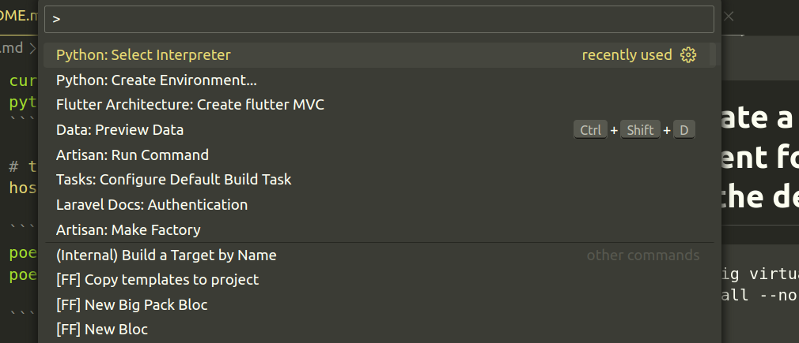
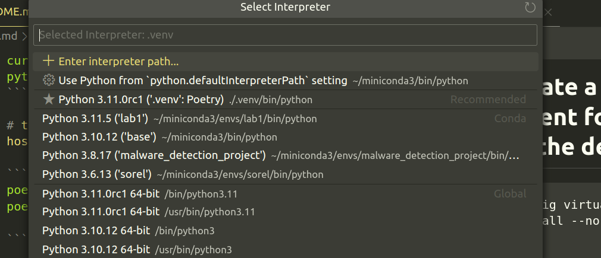
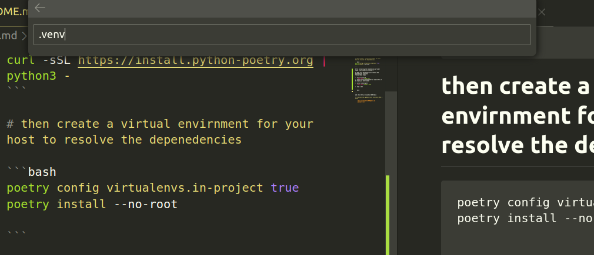

# To Build and run the server for the first time

# for a better experince install poetry with this command

```bash
curl -sSL https://install.python-poetry.org | python3 -
```

# then create a virtual envirnment for your host to resolve the depenedencies

```bash
poetry config virtualenvs.in-project true
poetry install --no-root

```

After installing the dependencies a folder named .venv shoudl be created.s

To make sure the editor will resolve the dependencies intalled
follow these steps

1. hit ctrt+shit+p
   
2. choose select Interpreter or search for it by typing in Interpreter

3. select choose path
   

4. type .venv
   

5. now you that your dev setup is ready type this commands to activate the venv and spin up the server

```bash
source activate .venv/bin/activate
uvicorn main:app  --port 8000
```

6. and check http://localhost:8000/docs

# To access the pgadmin visit localhost:9001 & enter

    email:raidrockstar040@gmil.com
    password:lol
